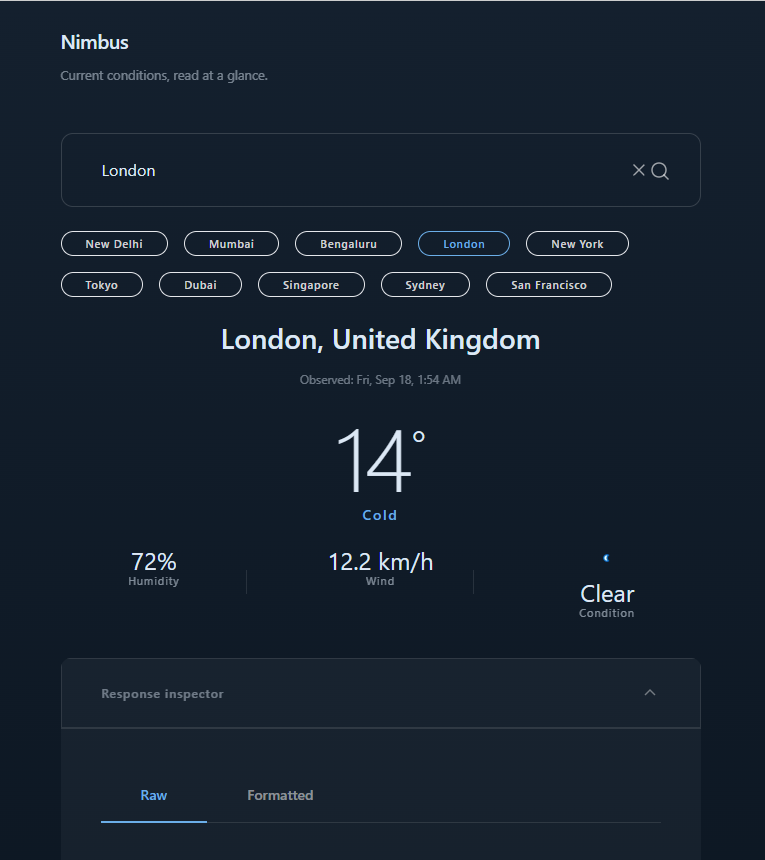
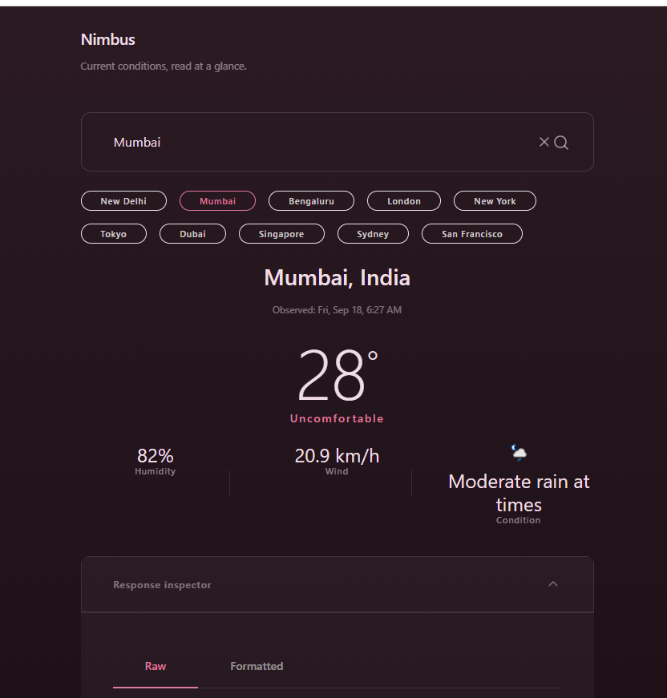
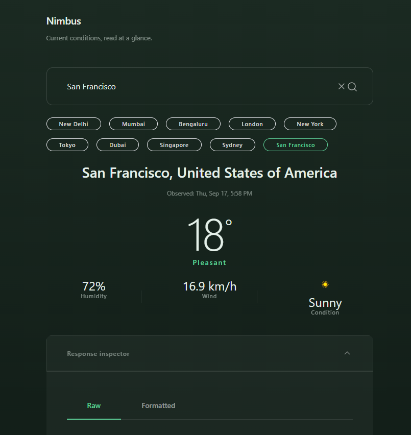

# Nimbus

Current conditions, read at a glance.

**Live:** https://nimbus-opencode.vercel.app/

---

## Why I built this

I was in Mumbai in July and my phone said 28°C. Sounded fine. I stepped
outside and it was awful — 81% humidity, shirt stuck to my back in three
minutes.

Same week, Delhi also hit 28°C. That day was lovely. Dry, breezy, fine.

Same number. Completely different day. My weather app told me nothing
useful either time.

So I built one that does the interpretation for me. Nimbus reads
temperature, humidity and wind, and gives you one word — Pleasant, Hot,
Cold, Windy or Uncomfortable — then colours the whole screen to match.
You can tell what kind of day it is from across the room.







Same app, three cities. You know which is which before reading anything.

---

## Keeping the API key safe

This was the part I actually cared about getting right.

To fetch weather data you need an API key. It's basically a password.
And the trap almost every beginner project falls into is putting that key
in the browser.

Here's why that's bad: press F12 on any website and you can read
everything it sent you. All of it. There's no "hide this" option. So if
the key is in the browser, it's public. Anyone can grab it and burn
through your quota.

So the key never goes there. When you click a city, your browser asks my
server. My server adds the key and asks the weather service. Then it
sends back only the weather.


You click "Mumbai"
↓
Browser → my server: "weather for Mumbai"
↓
My server → WeatherAPI (key attached here)
↓
My server → browser: just the weather, no key


It's the restaurant thing. You tell the waiter what you want, the waiter
goes into the kitchen, you never see the kitchen. You just get food.

Don't take my word for it — open the app, hit F12, click Network, click
any city. The only request you'll see goes to this app. Nothing ever
goes to the weather service from your browser.

---

## When things break

I wrote a real message for every failure. No blank screens, no error
codes nobody can read.

| Problem | You see |
|---|---|
| City doesn't exist | "We couldn't find that city." |
| Weather service is down | "Weather service unavailable." |
| Too many requests | "Too many requests. Try again soon." |
| Took too long | "Request timed out." |

---

## How the mood gets decided

Five rules, checked in order, first one wins:

| Order | Mood | When |
|---|---|---|
| 1 | Windy | Wind 25 km/h or more |
| 2 | Uncomfortable | 26°C+ **and** humidity 65%+ |
| 3 | Hot | 30°C or hotter |
| 4 | Cold | 15°C or colder |
| 5 | Pleasant | Everything else |

Wind goes first because strong wind changes a day more than anything
else. Sticky heat is checked before plain heat because that's the thing
people actually complain about.

---

## The bit where I got it wrong

My first version used 35°C for Hot and 10°C for Cold.

Both sound reasonable. Both were useless.

I tested ten cities and every single one came back "Pleasant." London at
14°, Dubai at 31°, Sydney at 17° — all the same. The entire point of the
app never fired once. And because the mood never changed, the
colour-changing background looked broken too. Ten screenshots, one
colour.

The numbers were too extreme. Most places people live sit somewhere
between 10 and 35, so nothing ever crossed the line.

Moved them to 30 and 15. Now London is Cold, Dubai is Uncomfortable, San
Francisco is Pleasant. Works.

What bothers me about this: my tests passed the whole time. Every one of
them. They were checking that the code followed my rules properly, and it
did. They just couldn't tell me the rules were rubbish.

Tests check the building. They don't check the blueprint. I'll remember
that one.

---

## What's still wrong with it

- **No caching.** Every search hits the weather service. Mumbai's weather
  doesn't change in 60 seconds, so caching would cut usage by most of
  90%.
- **"Hot" barely happens.** Dubai at 31° and 66% humidity reads
  Uncomfortable, because humidity gets checked first. Defensible, but I
  set it by accident rather than on purpose.
- **Request limiting is thin.** It resets more often than it should. Fine
  at this size, not fine at real scale.
- **No forecast.** Right now only.

---

## Running it

```bash
git clone https://github.com/imharshal11/nimbus-opencode.git
cd nimbus-opencode
npm install
```

Make a file called `.env.local`:


WEATHER_API_KEY=your_key_here


Free key from [weatherapi.com](https://www.weatherapi.com/).

```bash
npm run dev
```

If you deploy it, set `WEATHER_API_KEY` in your host's settings.
`.env.local` never leaves your machine — that's deliberate.

---

Next.js · TypeScript · Tailwind · WeatherAPI · Vercel

Built by Harshal S